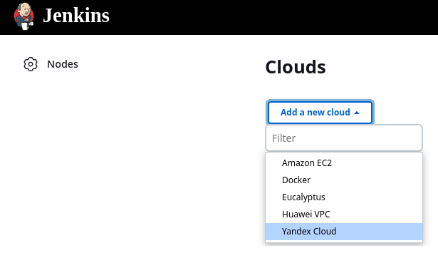
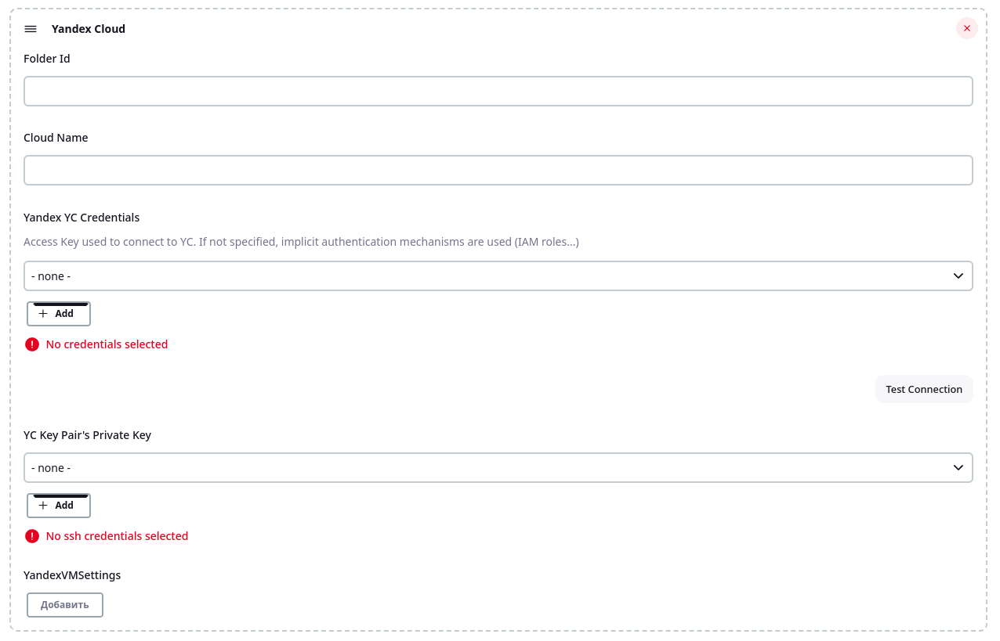
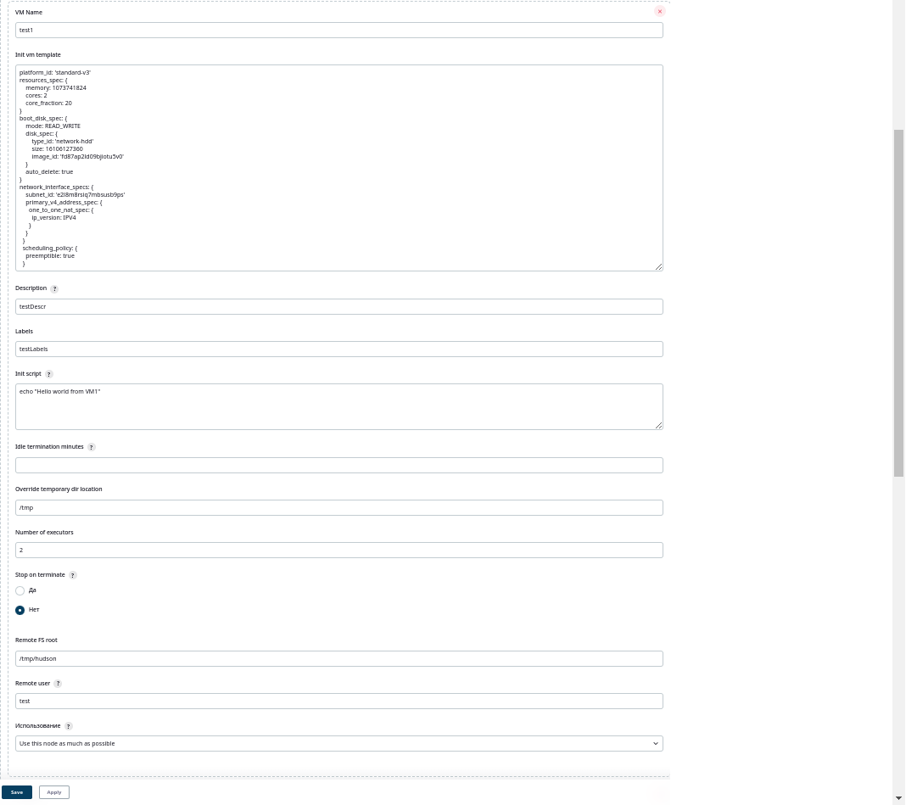

# Yandex cloud plugin for Jenkins

# Table of contents
   * [Introduction](#introduction)
   * [Usage](#usage)

# Introduction

With this plugin you can create and use virtual machine on [Yandex Cloud](https://cloud.yandex.com/en-ru/)
like agent on demand, and destroy them when they get unused. For creating and using virtual machines used
[Yandex Cloud API](https://cloud.yandex.com/en-ru/docs/compute/api-ref/). Plugin supports only debian based Linux distributions for now. 

# Usage

At first, you need create service account on [Yandex Cloud](https://cloud.yandex.com/en-ru/). A service account is an account that can be used by a program to manage resources in Yandex Cloud. By using service accounts you can flexibly configure access rights to resources for programs you wrote. Make sure the service account name is unique within your cloud. 
For more information, see [Service account](https://cloud.yandex.com/en-ru/docs/iam/concepts/users/service-accounts).

Install plugin and go to "Manage Jenkins" -> "Nodes and Clouds" -> "Clouds". 
There, you find button "Add a new cloud", and choose "Yandex cloud". 



After that, you can see UI form for configure your yandex cloud agent. 
To fill cloud name, folder id, select Yandex Service Account credentials, 
and SSH Private Key. 
Right now plugin support only RSA pem key format for SSH keys.
Read about API access key possible on [vendor documentation](https://cloud.yandex.com/en/docs/iam/operations/iam-token/create-for-sa) on authorized key section.

For convert existing key from openssh format run following command on copy of keyfile:
```shell
cp keyfile.key keyfile.pem
ssh-keygen -p -f keyfile.pem -m pem
```

For Yandex Service Account credentials we need to use "Secret file" Jenkins credentials type. For SSH Private Key we need to use "SSH Username with private key" credentials type. 



When you choose service account credentials, you may test connection.
If all right, you see "success", otherwise "Failed find service account", or "Failed to login".


Next configure your Yandex Cloud VM agents. On "Yandex VM Settings" section click "Add". 
InitVmTemplate is string in the form of the following pattern.
```
 platform_id: 'standard-v3'  
 resources_spec: {
  memory: 1073741824  
  cores: 2  
  core_fraction: 20  
 }  
 boot_disk_spec: {  
  mode: READ_WRITE  
  disk_spec: {  
   type_id: 'network-hdd'  
   size: 16106127360  
   image_id: 'fd87ap2ld09bjiotu5v0'  
  }  
 auto_delete: true  
 }  
 network_interface_specs: {  
  subnet_id: 'e2l8m8rsiq7mbsusb9ps'  
  primary_v4_address_spec: {  
   one_to_one_nat_spec: {  
    ip_version: IPV4  
   }  
  }  
 }  
 scheduling_policy: {  
  preemptible: true  
 }  
```

Template specification can be [found here](https://cloud.yandex.com/en/docs/compute/concepts/instance-groups/instance-template) 

Configuring labels that identifies jobs that could run on node created from this template. 
Multiple values can be specified when separated by space. When no labels are specified and usage mode is set to Use 
this node as much as possible, then no restrictions will apply and node will be eligible to execute any job.
Init script is the shell script to be run on the newly launched Compute Cloud instance, before Jenkins starts launching an agent.
Here you can install packages that you need.
Idle termination minutes is minutes variables for non-stopping vm work. If empty then vm work non-stop. But, if this value is not empty, and   
"Stop on terminate" is true, vm just stop after this value time. If "Stop on terminate" is false and idle termination is not empty, vm
was destroyed.


